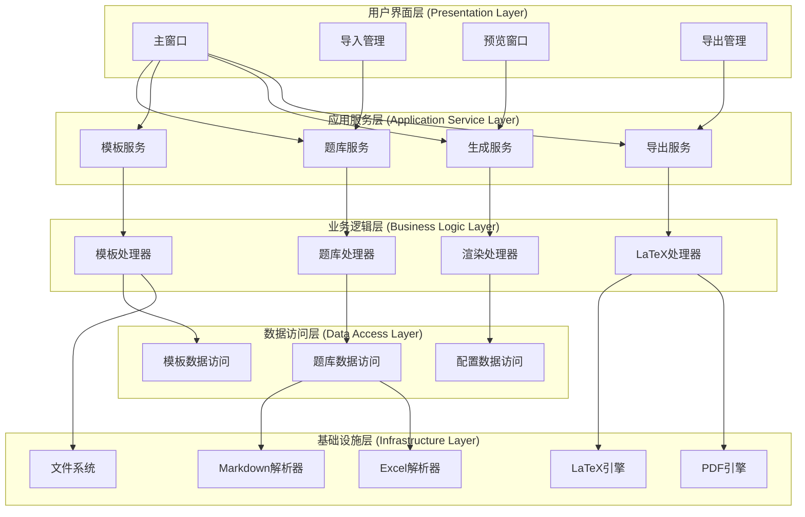
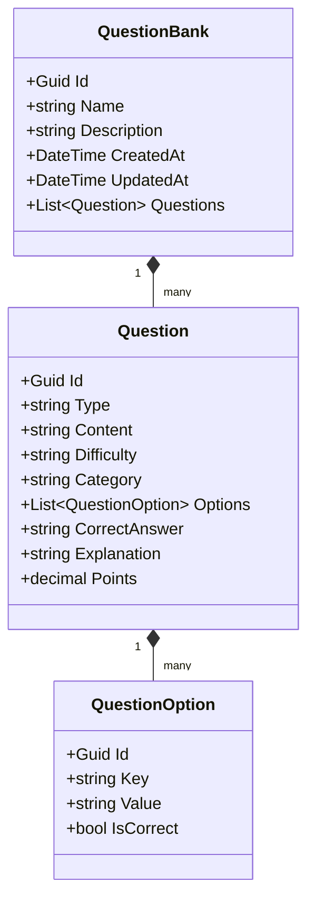
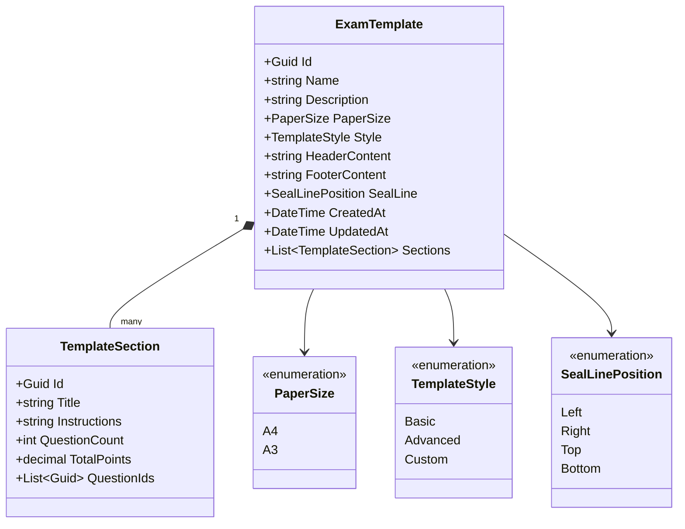
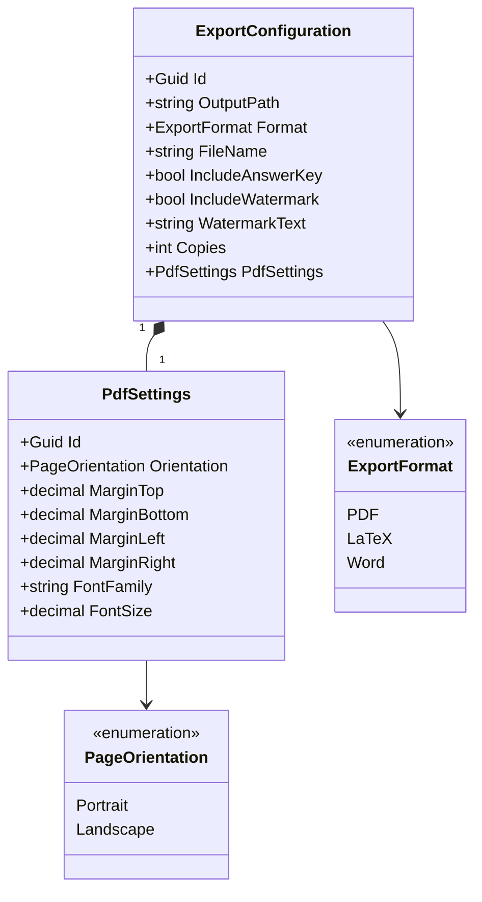
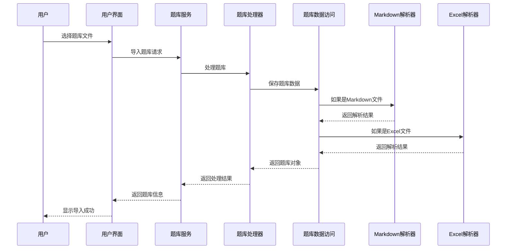
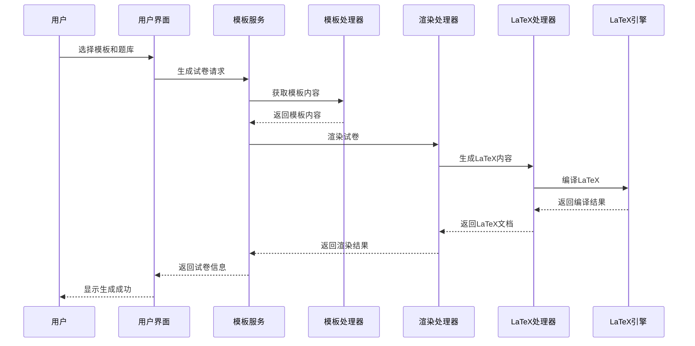
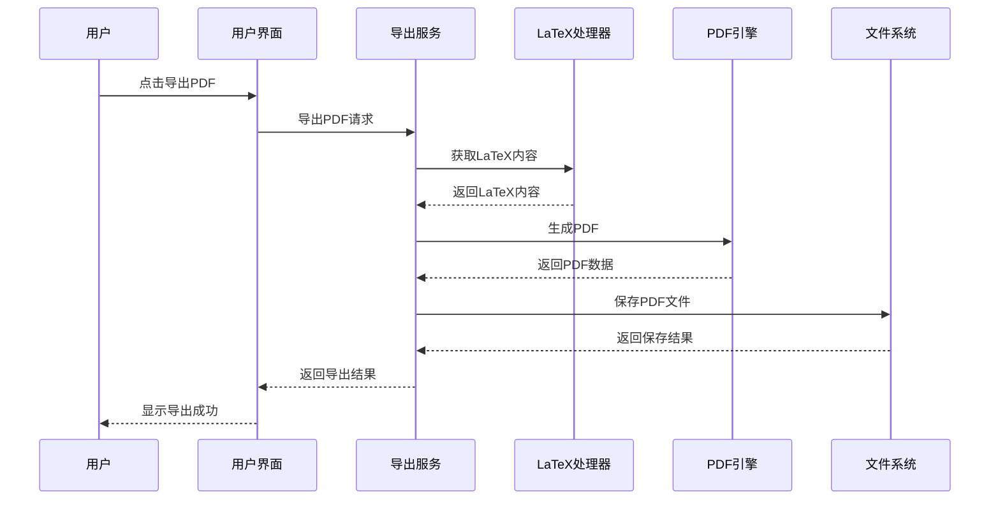

# Avalonia试卷生成系统 - 架构设计文档

## 1. 项目需求分析

### 1.1 功能需求
- **题库格式支持**：Markdown（标准标题和列表格式）和Excel（列式结构：题目、选项、答案等）格式解析
- **试卷布局设计**：支持A4和A3纸张，预设多种模板样式，密封线位置根据试卷类型自动调整
- **LaTeX模板设计**：多种样式和动态内容插入
- **动态内容生成**：题库内容转换、密封线位置调整
- **输出与打印**：PDF生成、打印预览

### 1.2 基本功能模块
- 题库导入
- 试卷生成
- PDF导出
- 简单预览

## 2. 系统整体架构设计

### 2.1 架构图



### 2.2 架构说明

系统采用分层架构设计，共分为五层：

1. **用户界面层 (Presentation Layer)**
   - 负责用户交互和界面展示
   - 基于Avalonia框架实现跨平台UI
   - 包含主窗口、导入管理、预览窗口和导出管理等组件

2. **应用服务层 (Application Service Layer)**
   - 协调业务逻辑层和用户界面层
   - 提供题库服务、模板服务、生成服务和导出服务
   - 处理用户请求并调用相应的业务逻辑

3. **业务逻辑层 (Business Logic Layer)**
   - 实现核心业务逻辑
   - 包含题库处理器、模板处理器、渲染处理器和LaTeX处理器
   - 负责数据处理、转换和业务规则实现

4. **数据访问层 (Data Access Layer)**
   - 提供数据持久化和检索功能
   - 包含题库数据访问、模板数据访问和配置数据访问
   - 隔离数据存储细节，提供统一的数据访问接口

5. **基础设施层 (Infrastructure Layer)**
   - 提供底层技术支持
   - 包含Markdown解析器、Excel解析器、LaTeX引擎、PDF引擎和文件系统
   - 处理文件格式解析、模板渲染和PDF生成等底层功能

### 2.3 组件交互流程

1. **题库导入流程**
   - 用户通过导入管理组件选择Markdown或Excel文件
   - 题库服务调用题库处理器
   - 题库处理器通过题库数据访问层调用相应的解析器
   - 解析后的数据存储到数据访问层

2. **试卷生成流程**
   - 用户选择模板和题库，点击生成按钮
   - 生成服务调用渲染处理器
   - 渲染处理器获取模板和题库数据
   - 渲染处理器调用LaTeX处理器生成LaTeX文档
   - LaTeX处理器调用LaTeX引擎编译文档

3. **PDF导出流程**
   - 用户点击导出按钮
   - 导出服务调用LaTeX处理器
   - LaTeX处理器调用PDF引擎生成PDF文件
   - PDF文件保存到指定位置

## 3. 技术栈选择

### 3.1 核心框架
- **Avalonia UI**: 11.0.0 或更高版本
  - 跨平台UI框架，支持Windows、macOS和Linux
  - 提供现代化的UI组件和灵活的布局系统
  - 支持MVVM模式，便于实现UI和业务逻辑的分离

### 3.2 LaTeX处理库
- **MiKTeX** 或 **TeX Live**: 作为LaTeX发行版
  - 提供完整的LaTeX编译环境
  - 支持中文处理（通过ctex宏包）
  - 提供丰富的模板和宏包

### 3.3 Markdown解析库
- **Markdig**: 0.31.0 或更高版本
  - 高性能的Markdown解析器
  - 支持CommonMark和GitHub Flavored Markdown
  - 可扩展的解析管道，支持自定义语法

### 3.4 Excel处理库
- **ClosedXML**: 0.102.1 或更高版本
  - 基于OpenXML的Excel文件处理库
  - 无需安装Excel即可读写Excel文件
  - 支持现代Excel格式（.xlsx）

### 3.5 PDF生成库
- **PdfSharp** 或 **iTextSharp**: 用于PDF处理
  - 提供PDF生成和操作功能
  - 支持中文文本和字体
  - 提供丰富的PDF操作API

### 3.6 其他技术
- **.NET 8**: 作为运行时环境
  - 提供高性能的运行时
  - 跨平台支持
  - 现代化的C#语言特性

- **ReactiveUI**: 用于实现MVVM模式
  - 与Avalonia UI完美集成
  - 提供响应式编程支持
  - 简化UI和业务逻辑的绑定

## 4. 项目结构设计

### 4.1 文件夹结构

```
QuizForge/
├── src/
│   ├── QuizForge.App/                # 应用程序入口
│   │   ├── Assets/                   # 应用程序资源
│   │   ├── Views/                    # 视图文件
│   │   ├── ViewModels/               # 视图模型
│   │   └── App.xaml                  # 应用程序配置
│   │
│   ├── QuizForge.Core/               # 核心业务逻辑
│   │   ├── Models/                   # 数据模型
│   │   ├── Services/                 # 业务服务
│   │   ├── Interfaces/               # 接口定义
│   │   └── Exceptions/               # 自定义异常
│   │
│   ├── QuizForge.Data/               # 数据访问层
│   │   ├── Repositories/             # 数据仓库
│   │   ├── Contexts/                 # 数据上下文
│   │   └── Migrations/               # 数据迁移
│   │
│   ├── QuizForge.Infrastructure/     # 基础设施层
│   │   ├── Parsers/                  # 解析器实现
│   │   ├── Engines/                  # 引擎实现
│   │   ├── FileSystems/              # 文件系统操作
│   │   └── External/                 # 外部依赖集成
│   │
│   └── QuizForge.Tests/              # 单元测试
│       ├── Unit/                     # 单元测试
│       ├── Integration/              # 集成测试
│       └── Mocks/                    # 模拟对象
│
├── templates/                        # LaTeX模板
│   ├── basic/                        # 基础模板
│   ├── advanced/                     # 高级模板
│   └── custom/                       # 自定义模板
│
├── samples/                          # 示例文件
│   ├── markdown/                     # Markdown示例
│   └── excel/                        # Excel示例
│
├── docs/                             # 文档
│   ├── user-guide/                   # 用户指南
│   ├── developer-guide/              # 开发者指南
│   └── api-reference/                # API参考
│
├── build/                            # 构建脚本
├── tools/                            # 开发工具
├── .gitignore
├── LICENSE
├── README.md
└── QuizForge.sln                     # 解决方案文件
```

### 4.2 命名空间组织

```
QuizForge                          # 根命名空间
├── App                            # 应用程序相关
│   ├── Views                      # 视图
│   ├── ViewModels                 # 视图模型
│   └── Commands                   # 命令
├── Core                           # 核心业务逻辑
│   ├── Models                     # 数据模型
│   │   ├── QuestionBank           # 题库模型
│   │   ├── Template               # 模板模型
│   │   └── ExamPaper              # 试卷模型
│   ├── Services                   # 业务服务
│   │   ├── IQuestionService       # 题库服务接口
│   │   ├── ITemplateService       # 模板服务接口
│   │   ├── IGenerationService     # 生成服务接口
│   │   └── IExportService         # 导出服务接口
│   ├── Interfaces                 # 接口定义
│   └── Exceptions                 # 自定义异常
├── Data                           # 数据访问层
│   ├── Repositories               # 数据仓库
│   │   ├── IQuestionRepository    # 题库仓库接口
│   │   ├── ITemplateRepository    # 模板仓库接口
│   │   └── IConfigRepository      # 配置仓库接口
│   ├── Contexts                   # 数据上下文
│   └── Migrations                 # 数据迁移
└── Infrastructure                 # 基础设施层
    ├── Parsers                    # 解析器
    │   ├── IMarkdownParser        # Markdown解析器接口
    │   ├── IExcelParser           # Excel解析器接口
    │   ├── MarkdownParser         # Markdown解析器实现
    │   └── ExcelParser            # Excel解析器实现
    ├── Engines                    # 引擎
    │   ├── ILaTeXEngine           # LaTeX引擎接口
    │   ├── IPdfEngine             # PDF引擎接口
    │   ├── LaTeXEngine            # LaTeX引擎实现
    │   └── PdfEngine              # PDF引擎实现
    ├── FileSystems                # 文件系统
    │   ├── IFileService           # 文件服务接口
    │   └── FileService            # 文件服务实现
    └── External                   # 外部依赖
```

## 5. 数据模型设计

### 5.1 题库数据模型



### 5.2 试卷模板模型



### 5.3 输出配置模型



## 6. API设计

### 6.1 核心服务接口

#### 6.1.1 题库服务接口

```csharp
public interface IQuestionService
{
    Task<QuestionBank> ImportQuestionBankAsync(string filePath, QuestionBankFormat format);
    Task<QuestionBank> GetQuestionBankAsync(Guid id);
    Task<List<QuestionBank>> GetAllQuestionBanksAsync();
    Task<QuestionBank> UpdateQuestionBankAsync(QuestionBank questionBank);
    Task<bool> DeleteQuestionBankAsync(Guid id);
    Task<List<Question>> GetQuestionsByCategoryAsync(string category);
    Task<List<Question>> GetQuestionsByDifficultyAsync(string difficulty);
    Task<List<Question>> GetRandomQuestionsAsync(int count, string category = null, string difficulty = null);
}
```

#### 6.1.2 模板服务接口

```csharp
public interface ITemplateService
{
    Task<ExamTemplate> GetTemplateAsync(Guid id);
    Task<List<ExamTemplate>> GetAllTemplatesAsync();
    Task<ExamTemplate> CreateTemplateAsync(ExamTemplate template);
    Task<ExamTemplate> UpdateTemplateAsync(ExamTemplate template);
    Task<bool> DeleteTemplateAsync(Guid id);
    Task<string> GenerateTemplateContentAsync(ExamTemplate template, List<Question> questions);
    Task<List<string>> GetAvailableTemplateStylesAsync();
}
```

#### 6.1.3 生成服务接口

```csharp
public interface IGenerationService
{
    Task<ExamPaper> GenerateExamPaperAsync(Guid templateId, Guid questionBankId, ExamPaperOptions options);
    Task<string> GenerateLaTeXContentAsync(ExamPaper examPaper);
    Task<Stream> GeneratePreviewAsync(string latexContent);
    Task<bool> ValidateExamPaperAsync(ExamPaper examPaper);
    Task<ExamPaper> RegenerateExamPaperAsync(ExamPaper examPaper);
}
```

#### 6.1.4 导出服务接口

```csharp
public interface IExportService
{
    Task<string> ExportToPdfAsync(string latexContent, ExportConfiguration configuration);
    Task<string> ExportToLaTeXAsync(string latexContent, ExportConfiguration configuration);
    Task<string> ExportToWordAsync(string latexContent, ExportConfiguration configuration);
    Task<byte[]> GeneratePreviewImageAsync(string latexContent, int width = 800, int height = 600);
    Task<bool> PrintDocumentAsync(string filePath, PrintSettings settings);
}
```

### 6.2 数据访问层接口

#### 6.2.1 题库仓库接口

```csharp
public interface IQuestionRepository
{
    Task<QuestionBank> GetByIdAsync(Guid id);
    Task<List<QuestionBank>> GetAllAsync();
    Task<QuestionBank> AddAsync(QuestionBank questionBank);
    Task<QuestionBank> UpdateAsync(QuestionBank questionBank);
    Task<bool> DeleteAsync(Guid id);
    Task<List<Question>> GetQuestionsByBankIdAsync(Guid bankId);
    Task<List<Question>> GetQuestionsByCategoryAsync(string category);
    Task<List<Question>> GetQuestionsByDifficultyAsync(string difficulty);
}
```

#### 6.2.2 模板仓库接口

```csharp
public interface ITemplateRepository
{
    Task<ExamTemplate> GetByIdAsync(Guid id);
    Task<List<ExamTemplate>> GetAllAsync();
    Task<ExamTemplate> AddAsync(ExamTemplate template);
    Task<ExamTemplate> UpdateAsync(ExamTemplate template);
    Task<bool> DeleteAsync(Guid id);
    Task<List<TemplateSection>> GetSectionsByTemplateIdAsync(Guid templateId);
}
```

#### 6.2.3 配置仓库接口

```csharp
public interface IConfigRepository
{
    Task<T> GetAsync<T>(string key) where T : class;
    Task SetAsync<T>(string key, T value) where T : class;
    Task<bool> RemoveAsync(string key);
    Task<bool> ExistsAsync(string key);
    Task<Dictionary<string, object>> GetAllAsync();
}
```

### 6.3 用户界面API

#### 6.3.1 主窗口视图模型

```csharp
public class MainViewModel : ReactiveObject
{
    public ReactiveCommand<Unit, Unit> ImportQuestionBankCommand { get; }
    public ReactiveCommand<Unit, Unit> ManageTemplatesCommand { get; }
    public ReactiveCommand<Unit, Unit> GenerateExamPaperCommand { get; }
    public ReactiveCommand<Unit, Unit> ExportCommand { get; }
    
    public ObservableCollection<QuestionBank> QuestionBanks { get; }
    public ObservableCollection<ExamTemplate> Templates { get; }
    
    public QuestionBank SelectedQuestionBank { get; set; }
    public ExamTemplate SelectedTemplate { get; set; }
    
    public MainViewModel(
        IQuestionService questionService,
        ITemplateService templateService,
        IGenerationService generationService,
        IExportService exportService)
    {
        // 初始化命令和属性
    }
}
```

#### 6.3.2 题库导入视图模型

```csharp
public class ImportQuestionBankViewModel : ReactiveObject
{
    public ReactiveCommand<Unit, Unit> BrowseFileCommand { get; }
    public ReactiveCommand<Unit, Unit> ImportCommand { get; }
    public ReactiveCommand<Unit, Unit> CancelCommand { get; }
    
    public string FilePath { get; set; }
    public QuestionBankFormat SelectedFormat { get; set; }
    public string BankName { get; set; }
    public string BankDescription { get; set; }
    
    public ImportQuestionBankViewModel(IQuestionService questionService)
    {
        // 初始化命令和属性
    }
}
```

#### 6.3.3 试卷生成视图模型

```csharp
public class GenerateExamPaperViewModel : ReactiveObject
{
    public ReactiveCommand<Unit, Unit> GenerateCommand { get; }
    public ReactiveCommand<Unit, Unit> PreviewCommand { get; }
    public ReactiveCommand<Unit, Unit> ExportCommand { get; }
    
    public ExamTemplate SelectedTemplate { get; set; }
    public QuestionBank SelectedQuestionBank { get; set; }
    public ExamPaperOptions Options { get; set; }
    
    public ExamPaper GeneratedPaper { get; private set; }
    public byte[] PreviewImage { get; private set; }
    
    public GenerateExamPaperViewModel(
        ITemplateService templateService,
        IQuestionService questionService,
        IGenerationService generationService,
        IExportService exportService)
    {
        // 初始化命令和属性
    }
}
```

## 7. 工作流程设计

### 7.1 题库解析流程



### 7.2 模板渲染流程



### 7.3 PDF生成流程



## 8. 系统扩展性考虑

### 8.1 题库格式扩展
- 通过实现`IQuestionParser`接口，可以轻松添加新的题库格式支持
- 使用工厂模式管理不同格式的解析器
- 配置文件中注册新的解析器，无需修改核心代码

### 8.2 模板样式扩展
- 模板系统采用插件化设计，可以动态加载新的模板样式
- 模板配置与模板内容分离，便于维护和扩展
- 支持用户自定义模板，通过模板编辑器创建个性化样式

### 8.3 输出格式扩展
- 通过实现`IExportEngine`接口，可以添加新的输出格式支持
- 导出引擎与核心逻辑解耦，便于独立开发和测试
- 支持批量导出和自定义导出配置

### 8.4 国际化支持
- 界面文本与代码分离，支持多语言切换
- 模板内容支持多语言，可以生成不同语言的试卷
- 配置文件中管理语言资源，便于添加新语言支持

## 9. 性能优化考虑

### 9.1 题库解析优化
- 大文件采用流式解析，减少内存占用
- 解析结果缓存，避免重复解析
- 异步处理，提高用户界面响应速度

### 9.2 模板渲染优化
- 模板预编译，减少渲染时间
- 增量渲染，只更新变化的部分
- 渲染结果缓存，提高重复生成速度

### 9.3 PDF生成优化
- LaTeX引擎池化，减少启动开销
- 并行处理多个PDF生成任务
- 增量编译，只重新编译变化的部分

## 10. 安全性考虑

### 10.1 文件安全
- 文件上传限制，防止恶意文件上传
- 文件内容验证，确保文件格式正确
- 文件路径安全，防止路径遍历攻击

### 10.2 数据安全
- 敏感数据加密存储
- 用户权限控制，防止未授权访问
- 操作日志记录，便于审计和追踪

### 10.3 系统安全
- 输入验证，防止注入攻击
- 异常处理，避免信息泄露
- 定期更新依赖库，修复安全漏洞

## 11. 部署和运维考虑

### 11.1 部署方式
- 支持Windows、macOS和Linux平台
- 提供安装包和便携版两种部署方式
- 支持自动更新机制

### 11.2 配置管理
- 配置文件与程序分离，便于管理
- 支持环境变量覆盖配置
- 配置热更新，无需重启应用

### 11.3 日志和监控
- 结构化日志记录，便于分析和查询
- 关键操作性能监控
- 错误报告和诊断信息收集

## 12. 总结

本架构设计文档详细描述了Avalonia试卷生成系统的整体架构、技术栈选择、项目结构、数据模型、API设计和工作流程。系统采用分层架构设计，具有良好的可扩展性、可维护性和性能。

通过模块化设计和接口抽象，系统可以轻松扩展新的题库格式、模板样式和输出格式。同时，通过性能优化和安全性考虑，确保系统在处理大量数据时的稳定性和安全性。

该架构设计为系统的实现提供了清晰的指导，可以作为开发团队的技术蓝图和参考文档。