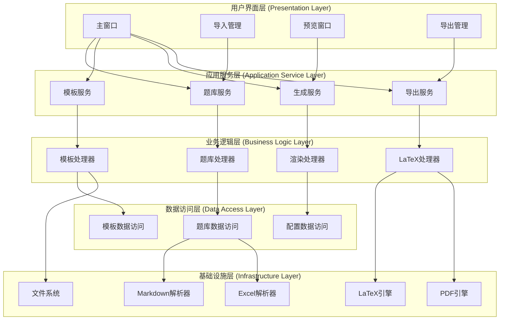

# QuizForge 项目概述

## 1. 项目背景

### 1.1 项目起源和目的

QuizForge是一个基于.NET的试卷生成系统，旨在为教育机构、教师和考试组织者提供一个高效、灵活的试卷生成解决方案。项目起源于对传统试卷制作流程繁琐、耗时的痛点，通过自动化技术简化试卷生成过程，提高教育工作效率。

项目的核心目的是实现"自动通过题库生成试卷"的功能，支持多种题库格式（Markdown、Excel等），提供灵活的模板系统，并能生成高质量的PDF试卷文档。

### 1.2 核心价值和应用场景

#### 核心价值
- **高效性**：自动化试卷生成流程，大幅减少人工操作时间
- **灵活性**：支持多种题库格式和自定义模板，满足不同教育场景需求
- **专业性**：基于LaTeX技术生成高质量排版的专业试卷
- **可扩展性**：模块化设计，便于功能扩展和维护

#### 应用场景
- **学校教育**：教师快速生成单元测试、期中/期末考试试卷
- **培训机构**：根据题库自动生成练习题和模拟考试
- **在线教育**：为在线课程提供配套的练习和测试材料
- **考试机构**：标准化考试试卷的批量生成和管理

### 1.3 技术栈和架构选择

#### 技术栈
- **前端框架**：Avalonia UI 11.0.0+ - 跨平台UI框架，支持Windows、macOS和Linux
- **后端技术**：.NET 8 - 提供高性能运行时和现代化C#语言特性
- **UI模式**：MVVM (Model-View-ViewModel) - 使用ReactiveUI实现响应式编程
- **文档生成**：LaTeX (MiKTeX或TeX Live) - 专业排版系统，支持中文处理
- **数据处理**：
  - Markdig 0.31.0+ - Markdown解析库
  - ClosedXML 0.102.1+ - Excel文件处理库
- **PDF处理**：PdfSharp或iTextSharp - PDF生成和操作
- **数据库**：SQLite - 轻量级数据库，便于部署和管理

#### 架构选择
项目采用分层架构设计，包括：
- **用户界面层**：基于Avalonia UI实现跨平台用户交互
- **应用服务层**：协调业务逻辑和用户界面
- **业务逻辑层**：实现核心业务规则和数据处理
- **数据访问层**：提供数据持久化和检索功能
- **基础设施层**：提供底层技术支持，如文件解析、PDF生成等

这种架构选择确保了系统的可维护性、可扩展性和高内聚低耦合的设计原则。

## 2. 项目目标

### 2.1 功能需求

#### 核心功能
1. **题库管理**
   - 支持多种题库格式导入（Markdown、Excel、JSON、XML）
   - 题库分类、标签和难度管理
   - 题目增删改查操作
   - 题目选项和答案管理

2. **模板系统**
   - 预设多种试卷模板（基础、高级、自定义）
   - 支持A4和A3纸张尺寸
   - 灵活的页眉页脚配置
   - 密封线位置和内容自定义
   - 动态内容插入功能

3. **试卷生成**
   - 自动随机选题功能
   - 按难度、类别分布选题
   - 手动选题功能
   - 多页试卷生成
   - 试卷预览和编辑

4. **导出功能**
   - PDF格式导出
   - LaTeX源码导出
   - Word格式导出（规划中）
   - 批量导出功能
   - 自定义水印和设置

5. **批量生成**
   - 批量生成多份不同试卷
   - 进度跟踪和任务管理
   - 高级批量生成选项
   - 生成历史记录和报告

#### 高级功能
1. **打印预览**
   - 高质量PDF预览
   - 多页面预览
   - 缩放和旋转功能
   - 缩略图生成

2. **打印功能**
   - 直接打印PDF
   - 打印设置自定义
   - 双面打印支持

### 2.2 非功能需求

#### 性能需求
- **响应时间**：基本操作响应时间不超过2秒
- **批量生成**：支持同时生成多份试卷，系统资源占用合理
- **大文件处理**：能够处理包含1000+题目的题库文件
- **内存使用**：正常运行时内存占用不超过500MB

#### 可靠性需求
- **稳定性**：连续运行24小时无崩溃
- **数据完整性**：确保题库和生成试卷的数据完整性
- **错误处理**：完善的异常处理机制，提供友好的错误提示
- **备份恢复**：支持题库和模板的备份与恢复

#### 可维护性需求
- **代码质量**：遵循SOLID原则，代码结构清晰
- **文档完整**：提供完善的开发文档和用户手册
- **日志记录**：详细的操作日志和错误日志
- **测试覆盖**：核心功能单元测试覆盖率达到80%以上

#### 可扩展性需求
- **插件架构**：支持第三方插件扩展
- **模板扩展**：支持自定义模板开发
- **格式支持**：易于添加新的题库格式支持
- **API接口**：提供RESTful API供外部系统集成

#### 安全性需求
- **数据安全**：敏感数据加密存储
- **访问控制**：基于角色的权限管理（规划中）
- **输入验证**：严格的数据输入验证
- **审计日志**：关键操作审计跟踪

### 2.3 预期成果和交付物

#### 主要交付物
1. **QuizForge应用程序**
   - Windows桌面应用程序
   - 跨平台支持（macOS、Linux）
   - 安装程序和便携版

2. **核心组件**
   - 题库管理模块
   - 模板管理模块
   - 试卷生成引擎
   - PDF导出模块
   - 批量生成服务

3. **文档**
   - 用户操作手册
   - 开发者文档
   - API文档
   - 部署指南

4. **示例和模板**
   - 示例题库文件
   - 预设试卷模板
   - 自定义模板开发指南

#### 预期成果
- 提高试卷生成效率，减少80%的人工操作时间
- 支持多种教育场景的试卷生成需求
- 提供专业、高质量的试卷输出
- 建立可扩展的试卷生成平台，支持未来功能扩展

## 3. 已完成功能

### 3.1 核心功能模块

#### 3.1.1 数据模型层 (Models)
- **完成状态**：✅ 已完成
- **主要组件**：
  - `Question` - 题目模型，包含题目内容、选项、答案等
  - `QuestionBank` - 题库模型，管理题目集合
  - `ExamPaper` - 试卷模型，包含生成后的试卷内容
  - `ExamTemplate` - 试卷模板模型，定义试卷布局和样式
  - `HeaderConfig` - 页眉配置模型
  - `QuestionOption` - 题目选项模型
  - `TemplateSection` - 模板章节模型

- **技术亮点**：
  - 完整的数据模型设计，支持复杂的试卷结构
  - 灵活的模板配置系统，支持多种纸张尺寸和样式
  - 详细的密封线配置，支持动态位置调整
  - 完善的枚举类型定义，提高代码可读性

#### 3.1.2 核心业务逻辑层 (Core)
- **完成状态**：✅ 已完成
- **主要组件**：
  - `ExamPaperGenerator` - 试卷生成器，整合题库解析、内容生成和模板处理
  - `ContentGenerator` - 内容生成器，负责LaTeX内容生成
  - `DynamicContentInserter` - 动态内容插入器，处理模板中的动态内容
  - `LaTeXDocumentGenerator` - LaTeX文档生成器
  - `MathFormulaProcessor` - 数学公式处理器
  - `QuestionBankProcessor` - 题库处理器
  - `TemplateProcessor` - 模板处理器

- **技术亮点**：
  - 模块化设计，各组件职责明确
  - 支持多种试卷生成方式（随机、手动、批量）
  - 灵活的题目选择算法，支持难度和类别分布
  - 完善的LaTeX内容生成系统

#### 3.1.3 数据访问层 (Data)
- **完成状态**：✅ 已完成
- **主要组件**：
  - `QuizDbContext` - 数据库上下文
  - `QuestionRepository` - 题库数据访问
  - `TemplateRepository` - 模板数据访问
  - `ConfigRepository` - 配置数据访问
  - `DatabaseService` - 数据库服务

- **技术亮点**：
  - 基于Entity Framework Core的数据访问层
  - 仓储模式实现，提供统一的数据访问接口
  - 依赖注入支持，便于测试和维护
  - 数据库迁移支持，便于版本管理

#### 3.1.4 基础设施层 (Infrastructure)
- **完成状态**：✅ 大部分完成
- **主要组件**：
  - `LatexPdfEngine` - LaTeX PDF引擎，依赖外部LaTeX发行版
  - `NativePdfEngine` - 原生PDF引擎（规划中）
  - `MarkdownParser` - Markdown解析器
  - `ExcelParser` - Excel解析器
  - `LatexParser` - LaTeX解析器
  - `FileService` - 文件系统服务
  - `PdfCacheService` - PDF缓存服务
  - `BatchGenerationService` - 批量生成服务
  - `PdfErrorReportingService` - PDF错误报告服务
  - `PrintPreviewService` - 打印预览服务

- **技术亮点**：
  - 多种文件格式解析支持
  - 完整的LaTeX到PDF转换流程
  - PDF缓存机制，提高性能
  - 批量生成服务，支持大规模试卷生成

#### 3.1.5 应用服务层 (Services)
- **完成状态**：✅ 大部分完成
- **主要组件**：
  - `QuestionService` - 题库服务实现
  - `TemplateService` - 模板服务实现
  - `GenerationService` - 生成服务实现
  - `ExportService` - 导出服务实现

- **技术亮点**：
  - 完整的服务层实现，提供业务逻辑封装
  - 异步操作支持，提高系统响应性
  - 完善的错误处理机制
  - 服务层依赖注入，便于测试和扩展

#### 3.1.6 用户界面层 (App)
- **完成状态**：✅ 基本完成
- **主要组件**：
  - `MainWindow` - 主窗口
  - `QuestionBankView` - 题库管理视图
  - `TemplateView` - 模板管理视图
  - `ExamGenerationView` - 试卷生成视图
  - `PdfPreviewView` - PDF预览视图
  - `MainViewModel` - 主窗口视图模型
  - `QuestionBankViewModel` - 题库管理视图模型
  - `TemplateViewModel` - 模板管理视图模型
  - `ExamGenerationViewModel` - 试卷生成视图模型
  - `PdfPreviewViewModel` - PDF预览视图模型

- **技术亮点**：
  - 基于Avalonia UI的跨平台界面
  - MVVM架构模式，实现UI和业务逻辑分离
  - 响应式编程支持，提高用户体验
  - 完整的视图模型实现，支持数据绑定和命令

### 3.2 已实现功能的技术亮点

#### 3.2.1 分层架构设计
项目采用清晰的分层架构，各层职责明确，通过依赖注入实现松耦合设计。这种设计使得系统易于维护、测试和扩展。

#### 3.2.2 模块化组件设计
系统各功能模块高度模块化，每个组件都有明确的职责和接口，便于独立开发和测试。例如，试卷生成、模板处理、文件解析等功能都被设计为独立的组件。

#### 3.2.3 灵活的模板系统
模板系统支持多种预设样式（基础、高级、自定义），允许用户自定义页眉页脚、密封线位置和内容。系统还支持动态内容插入，可以根据需要生成不同布局的试卷。

#### 3.2.4 多格式题库支持
系统支持多种题库格式，包括Markdown和Excel，并计划支持JSON和XML格式。这种多格式支持使得用户可以使用自己习惯的方式管理和维护题库。

#### 3.2.5 高质量的PDF生成
基于LaTeX技术，系统能够生成高质量的PDF试卷，支持中文、数学公式、表格等复杂内容。PDF引擎支持多种配置选项，如页面方向、边距、字体等。

#### 3.2.6 批量生成能力
系统支持批量生成多份不同的试卷，每份试卷都有随机选择的题目，确保试卷的差异性。批量生成服务还支持进度跟踪和任务管理，适合大规模考试场景。

#### 3.2.7 跨平台支持
基于Avalonia UI框架，系统支持Windows、macOS和Linux等多个平台，为用户提供一致的体验。

## 4. 未完成任务

### 4.1 核心功能未完成任务

#### 4.1.1 题库服务增强
- **任务描述**：完善QuestionService中的GetRandomQuestionsAsync方法
- **优先级**：高
- **依赖关系**：依赖QuestionRepository的相应方法
- **技术要求**：实现随机获取题目的逻辑，支持类别和难度过滤
- **实现难点**：确保随机性同时满足过滤条件，处理大量数据时的性能问题

#### 4.1.2 生成服务预览功能
- **任务描述**：实现GenerationService中的GeneratePreviewAsync方法
- **优先级**：高
- **依赖关系**：依赖PDF引擎的预览生成功能
- **技术要求**：将LaTeX内容转换为预览图像流
- **实现难点**：LaTeX到图像的转换，预览质量控制

#### 4.1.3 导出服务Word支持
- **任务描述**：实现ExportService中的ExportToWordAsync方法
- **优先级**：中
- **依赖关系**：需要集成Word处理库
- **技术要求**：将LaTeX内容转换为Word文档
- **实现难点**：LaTeX到Word的格式转换，保持排版一致性

#### 4.1.4 批量生成服务实现
- **任务描述**：实现IBatchGenerationService接口的所有方法
- **优先级**：中
- **依赖关系**：依赖GenerationService和ExportService
- **技术要求**：实现批量生成、进度跟踪、任务管理等功能
- **实现难点**：异步任务管理，进度状态同步，大规模数据处理

### 4.2 基础设施层未完成任务

#### 4.2.1 原生PDF引擎
- **任务描述**：实现NativePdfEngine类
- **优先级**：中
- **依赖关系**：无直接依赖
- **技术要求**：不依赖外部LaTeX发行版，直接生成PDF
- **实现难点**：PDF格式规范实现，中文支持，复杂布局处理

#### 4.2.2 JSON和XML解析器
- **任务描述**：实现JSON和XML格式的题库解析器
- **优先级**：低
- **依赖关系**：需要更新IQuestionService接口
- **技术要求**：解析JSON和XML格式的题库文件
- **实现难点**：处理不同格式的数据结构，错误处理和验证

#### 4.2.3 打印预览服务完善
- **任务描述**：实现IPrintPreviewService接口的所有方法
- **优先级**：中
- **依赖关系**：依赖PDF引擎和图像处理库
- **技术要求**：实现PDF预览、缩放、旋转等功能
- **实现难点**：PDF页面渲染，图像处理，性能优化

### 4.3 用户界面层未完成任务

#### 4.3.1 主窗口功能实现
- **任务描述**：实现MainViewModel中的TODO标记方法
- **优先级**：高
- **依赖关系**：依赖各功能服务的实现
- **技术要求**：实现新建题库、导入题库、保存、导出等功能的UI逻辑
- **实现难点**：异步操作处理，用户状态管理，错误提示

#### 4.3.2 视图模型完善
- **任务描述**：完善各视图模型的实现
- **优先级**：高
- **依赖关系**：依赖相应服务的实现
- **技术要求**：实现数据绑定、命令处理、状态管理等功能
- **实现难点**：MVVM模式正确实现，响应式编程，内存管理

#### 4.3.3 用户界面优化
- **任务描述**：优化用户界面体验
- **优先级**：中
- **依赖关系**：无直接依赖
- **技术要求**：改进界面布局、交互流程、视觉设计
- **实现难点**：跨平台UI一致性，用户体验设计，响应式布局

### 4.4 测试和文档未完成任务

#### 4.4.1 单元测试完善
- **任务描述**：完善各组件的单元测试
- **优先级**：中
- **依赖关系**：无直接依赖
- **技术要求**：提高测试覆盖率，添加边界条件和异常情况测试
- **实现难点**：模拟依赖组件，测试数据准备，异步测试

#### 4.4.2 集成测试实现
- **任务描述**：实现系统集成测试
- **优先级**：中
- **依赖关系**：依赖各组件的基本实现
- **技术要求**：测试各组件间的交互，端到端功能测试
- **实现难点**：测试环境搭建，测试数据管理，自动化测试

#### 4.4.3 用户文档编写
- **任务描述**：编写用户操作手册和帮助文档
- **优先级**：低
- **依赖关系**：依赖功能的稳定实现
- **技术要求**：提供详细的操作指南和常见问题解答
- **实现难点**：文档内容组织，用户友好性，多语言支持

### 4.5 部署和发布未完成任务

#### 4.5.1 安装程序制作
- **任务描述**：制作应用程序安装程序
- **优先级**：中
- **依赖关系**：依赖应用程序的稳定版本
- **技术要求**：支持Windows、macOS和Linux的安装程序
- **实现难点**：跨平台打包，依赖管理，安装流程设计

#### 4.5.2 自动化构建流程
- **任务描述**：建立CI/CD自动化构建流程
- **优先级**：低
- **依赖关系**：无直接依赖
- **技术要求**：实现自动编译、测试、打包和发布
- **实现难点**：构建环境配置，多平台支持，发布流程管理

#### 4.5.3 版本管理和更新
- **任务描述**：实现应用程序版本管理和自动更新
- **优先级**：低
- **依赖关系**：依赖应用程序的稳定版本
- **技术要求**：版本检查、下载和自动更新功能
- **实现难点**：更新机制设计，版本兼容性，网络异常处理

## 5. 技术架构

### 5.1 整体架构设计

QuizForge采用分层架构设计，共分为五层：用户界面层、应用服务层、业务逻辑层、数据访问层和基础设施层。这种架构设计确保了系统的高内聚低耦合，便于维护、测试和扩展。



### 5.2 各层职责和交互

#### 5.2.1 用户界面层 (Presentation Layer)
**职责**：
- 负责用户交互和界面展示
- 基于Avalonia框架实现跨平台UI
- 包含主窗口、导入管理、预览窗口和导出管理等组件

**主要组件**：
- `MainWindow` - 应用程序主窗口
- `QuestionBankView` - 题库管理视图
- `TemplateView` - 模板管理视图
- `ExamGenerationView` - 试卷生成视图
- `PdfPreviewView` - PDF预览视图
- 各视图对应的ViewModel

**交互方式**：
- 通过MVVM模式与业务逻辑层交互
- 使用命令和属性绑定实现用户操作响应
- 通过依赖注入获取服务层实例

#### 5.2.2 应用服务层 (Application Service Layer)
**职责**：
- 协调业务逻辑层和用户界面层
- 提供题库服务、模板服务、生成服务和导出服务
- 处理用户请求并调用相应的业务逻辑

**主要组件**：
- `QuestionService` - 题库服务实现
- `TemplateService` - 模板服务实现
- `GenerationService` - 生成服务实现
- `ExportService` - 导出服务实现

**交互方式**：
- 接收用户界面层的请求
- 调用业务逻辑层的处理器
- 处理业务逻辑并返回结果
- 提供事务管理和异常处理

#### 5.2.3 业务逻辑层 (Business Logic Layer)
**职责**：
- 实现核心业务逻辑
- 包含题库处理器、模板处理器、渲染处理器和LaTeX处理器
- 负责数据处理、转换和业务规则实现

**主要组件**：
- `ExamPaperGenerator` - 试卷生成器
- `ContentGenerator` - 内容生成器
- `DynamicContentInserter` - 动态内容插入器
- `QuestionBankProcessor` - 题库处理器
- `TemplateProcessor` - 模板处理器

**交互方式**：
- 接收应用服务层的调用
- 调用数据访问层获取数据
- 处理业务逻辑并返回结果
- 实现业务规则和验证逻辑

#### 5.2.4 数据访问层 (Data Access Layer)
**职责**：
- 提供数据持久化和检索功能
- 包含题库数据访问、模板数据访问和配置数据访问
- 隔离数据存储细节，提供统一的数据访问接口

**主要组件**：
- `QuizDbContext` - 数据库上下文
- `QuestionRepository` - 题库数据访问
- `TemplateRepository` - 模板数据访问
- `ConfigRepository` - 配置数据访问

**交互方式**：
- 接收业务逻辑层的调用
- 与数据库进行交互
- 提供数据的CRUD操作
- 实现数据访问的抽象和封装

#### 5.2.5 基础设施层 (Infrastructure Layer)
**职责**：
- 提供底层技术支持
- 包含Markdown解析器、Excel解析器、LaTeX引擎、PDF引擎和文件系统
- 处理文件格式解析、模板渲染和PDF生成等底层功能

**主要组件**：
- `LatexPdfEngine` - LaTeX PDF引擎
- `MarkdownParser` - Markdown解析器
- `ExcelParser` - Excel解析器
- `FileService` - 文件系统服务
- `BatchGenerationService` - 批量生成服务

**交互方式**：
- 被业务逻辑层调用
- 提供底层技术功能的实现
- 处理文件操作、格式解析等任务
- 与外部系统（如LaTeX发行版）交互

### 5.3 关键类和接口设计思路

#### 5.3.1 数据模型设计
数据模型采用实体-值对象模式，确保数据的完整性和一致性。主要模型包括：

- `Question` - 表示单个题目，包含内容、选项、答案等属性
- `QuestionBank` - 表示题库，包含多个题目
- `ExamPaper` - 表示生成的试卷，包含题目集合和模板信息
- `ExamTemplate` - 表示试卷模板，定义试卷的布局和样式

设计思路：
- 使用GUID作为主键，避免分布式环境下的ID冲突
- 使用枚举类型表示固定的选项集，提高代码可读性
- 使用集合类型表示一对多关系，如题库包含多个题目
- 使用值对象表示复杂属性，如密封线配置

#### 5.3.2 服务接口设计
服务接口采用面向接口的设计原则，定义清晰的契约，便于实现和测试。主要接口包括：

- `IQuestionService` - 题库服务接口
- `ITemplateService` - 模板服务接口
- `IGenerationService` - 生成服务接口
- `IExportService` - 导出服务接口
- `IBatchGenerationService` - 批量生成服务接口

设计思路：
- 使用异步方法提高系统响应性
- 使用DTO（数据传输对象）传递数据，避免暴露内部模型
- 使用异常处理机制传递错误信息
- 使用接口隔离原则，保持接口的单一职责

#### 5.3.3 仓储模式设计
仓储模式提供数据访问的抽象，隔离业务逻辑和数据存储细节。主要仓储包括：

- `IQuestionRepository` - 题库仓储接口
- `ITemplateRepository` - 模板仓储接口
- `IConfigRepository` - 配置仓储接口

设计思路：
- 定义统一的CRUD操作接口
- 使用泛型提供类型安全的查询方法
- 使用规范模式实现复杂查询
- 使用单元工作模式管理事务

#### 5.3.4 引擎和服务设计
引擎和服务提供具体的技术实现，处理文件解析、PDF生成等任务。主要引擎和服务包括：

- `IPdfEngine` - PDF引擎接口
- `IMarkdownParser` - Markdown解析器接口
- `IExcelParser` - Excel解析器接口
- `IFileService` - 文件服务接口

设计思路：
- 使用策略模式支持多种实现方式
- 使用工厂模式创建具体实例
- 使用依赖注入提供运行时替换能力
- 使用适配器模式集成第三方库

## 6. 部署和运行指南

### 6.1 环境要求

#### 6.1.1 硬件要求
- **CPU**：x86或x64架构处理器，建议2GHz以上多核处理器
- **内存**：最低4GB RAM，建议8GB以上
- **硬盘**：至少1GB可用空间，用于应用程序和数据存储
- **显示**：1024x768分辨率或更高

#### 6.1.2 软件要求
- **操作系统**：
  - Windows 10或更高版本（64位）
  - macOS 10.15或更高版本
  - Linux发行版（如Ubuntu 20.04、Fedora 33或更高版本）

- **运行时环境**：
  - .NET 8.0 Runtime
  - 可通过.NET官方下载页面获取

- **外部依赖**：
  - LaTeX发行版（可选，用于PDF生成）：
    - Windows：MiKTeX或TeX Live
    - macOS：MacTeX或TeX Live
    - Linux：TeX Live（可通过包管理器安装）

- **数据库**：
  - SQLite（内置，无需额外安装）

### 6.2 构建和运行步骤

#### 6.2.1 源代码构建
1. **获取源代码**
   ```bash
   git clone <repository-url>
   cd QuizForge
   ```

2. **还原依赖**
   ```bash
   dotnet restore
   ```

3. **构建项目**
   ```bash
   dotnet build --configuration Release
   ```

4. **运行测试**
   ```bash
   dotnet test
   ```

5. **发布应用程序**
   ```bash
   dotnet publish --configuration Release --output ./publish
   ```

#### 6.2.2 运行应用程序
1. **Windows系统**
   - 进入发布目录：`cd publish`
   - 运行可执行文件：`QuizForge.App.exe`

2. **macOS系统**
   - 进入发布目录：`cd publish`
   - 运行可执行文件：`./QuizForge.App`

3. **Linux系统**
   - 进入发布目录：`cd publish`
   - 运行可执行文件：`./QuizForge.App`

#### 6.2.3 安装LaTeX发行版（可选）
如果需要使用LaTeX生成PDF，建议安装相应的LaTeX发行版：

1. **Windows系统 - MiKTeX**
   - 下载MiKTeX安装程序：https://miktex.org/download
   - 运行安装程序，按照提示完成安装
   - 确保将MiKTeX bin目录添加到系统PATH环境变量

2. **Windows系统 - TeX Live**
   - 下载TeX Live安装程序：https://tug.org/texlive/
   - 运行安装程序，按照提示完成安装
   - 确保将TeX Live bin目录添加到系统PATH环境变量

3. **macOS系统 - MacTeX**
   - 下载MacTeX安装包：https://tug.org/mactex/
   - 运行安装包，按照提示完成安装

4. **Linux系统 - TeX Live**
   - 使用包管理器安装：
     ```bash
     # Ubuntu/Debian
     sudo apt-get update
     sudo apt-get install texlive-full
     
     # Fedora
     sudo dnf install texlive-scheme-full
     
     # Arch Linux
     sudo pacman -S texlive-most
     ```

### 6.3 配置选项和自定义方法

#### 6.3.1 应用程序配置
应用程序配置文件位于`appsettings.json`，主要配置项包括：

```json
{
  "Logging": {
    "LogLevel": {
      "Default": "Information",
      "Microsoft": "Warning",
      "Microsoft.Hosting.Lifetime": "Information"
    }
  },
  "AllowedHosts": "*",
  "ConnectionStrings": {
    "DefaultConnection": "Data Source=quizforge.db"
  },
  "LaTeX": {
    "ExecutablePath": "",
    "TempDirectory": "",
    "Timeout": 300
  },
  "Pdf": {
    "DefaultFont": "SimSun",
    "DefaultFontSize": 12,
    "DefaultMargin": 2.5
  },
  "Preview": {
    "DefaultWidth": 800,
    "DefaultHeight": 600,
    "DefaultQuality": 90
  }
}
```

**配置说明**：
- `Logging` - 日志配置，控制日志级别
- `ConnectionStrings` - 数据库连接字符串
- `LaTeX` - LaTeX相关配置
  - `ExecutablePath` - LaTeX可执行文件路径（可选，系统会自动查找）
  - `TempDirectory` - 临时文件目录（可选，默认为系统临时目录）
  - `Timeout` - LaTeX编译超时时间（秒）
- `Pdf` - PDF生成默认配置
  - `DefaultFont` - 默认字体
  - `DefaultFontSize` - 默认字号
  - `DefaultMargin` - 默认边距（厘米）
- `Preview` - 预览默认配置
  - `DefaultWidth` - 默认预览宽度
  - `DefaultHeight` - 默认预览高度
  - `DefaultQuality` - 默认预览质量

#### 6.3.2 自定义模板
系统支持自定义LaTeX模板，用户可以创建自己的试卷模板：

1. **模板位置**
   - 将自定义模板文件（.tex）放在应用程序目录的`Templates`文件夹中

2. **模板结构**
   - 模板文件应包含基本的LaTeX文档结构
   - 使用特殊标记表示动态内容插入点，如`{{content}}`、`{{title}}`等

3. **模板示例**
   ```latex
   \documentclass{article}
   \usepackage{ctex}
   \usepackage{geometry}
   \geometry{a4paper, left=2.5cm, right=2.5cm, top=2.5cm, bottom=2.5cm}
   
   \begin{document}
   
   \begin{center}
   {\Large \textbf{{{title}}}}
   \end{center}
   
   \vspace{1cm}
   
   {{content}}
   
   \end{document}
   ```

4. **模板注册**
   - 在应用程序中选择"模板管理"
   - 点击"添加模板"，选择模板文件
   - 配置模板属性（名称、描述、纸张尺寸等）

#### 6.3.3 自定义题库格式
系统支持扩展题库格式，用户可以添加自定义的题库格式支持：

1. **实现解析器接口**
   - 创建实现`IQuestionParser`接口的类
   - 实现`ParseAsync`方法，解析自定义格式的题库文件

2. **注册解析器**
   - 在依赖注入配置中注册自定义解析器
   - 更新`QuestionService`以支持新的格式

3. **示例代码**
   ```csharp
   public class CustomQuestionParser : IQuestionParser
   {
       public async Task<QuestionBank> ParseAsync(string filePath)
       {
           // 实现自定义格式的解析逻辑
           var questionBank = new QuestionBank();
           // ... 解析逻辑
           return questionBank;
       }
   }
   ```

#### 6.3.4 数据库配置
系统使用SQLite作为数据库，数据库文件默认位于应用程序目录下的`quizforge.db`：

1. **数据库位置**
   - 默认位置：应用程序目录下的`quizforge.db`
   - 可通过配置文件中的`ConnectionStrings`修改

2. **数据库备份**
   - 直接复制`quizforge.db`文件即可备份
   - 建议定期备份数据库文件

3. **数据库迁移**
   - 系统支持自动数据库迁移
   - 首次运行时，系统会自动创建数据库和表结构
   - 版本升级时，系统会自动应用数据库迁移

#### 6.3.5 日志配置
系统使用.NET Core日志框架，日志配置位于`appsettings.json`：

1. **日志级别**
   - `Trace` - 最详细的信息，通常仅用于开发
   - `Debug` - 调试信息
   - `Information` - 一般信息
   - `Warning` - 警告信息
   - `Error` - 错误信息
   - `Critical` - 严重错误信息

2. **日志位置**
   - Windows：`%APPDATA%\QuizForge\logs`
   - macOS：`~/Library/Logs/QuizForge`
   - Linux：`~/.local/share/QuizForge/logs`

3. **自定义日志配置**
   - 修改`appsettings.json`中的`Logging`部分
   - 可以按类别设置不同的日志级别

#### 6.3.6 性能优化
系统提供多种性能优化选项：

1. **PDF缓存**
   - 系统会缓存生成的PDF文件，提高重复访问速度
   - 可通过配置文件调整缓存策略

2. **批量生成优化**
   - 批量生成试卷时，系统会自动优化资源使用
   - 可通过配置文件调整并行生成数量

3. **内存优化**
   - 系统会自动管理内存使用，处理大量数据时会释放不必要的资源
   - 可通过配置文件调整内存使用限制

#### 6.3.7 故障排除
常见问题及解决方案：

1. **LaTeX编译失败**
   - 确保已安装LaTeX发行版
   - 检查LaTeX可执行文件是否在PATH环境变量中
   - 查看日志文件获取详细错误信息

2. **PDF生成失败**
   - 检查LaTeX模板语法是否正确
   - 确保系统有足够的磁盘空间
   - 尝试使用更简单的模板测试

3. **题库导入失败**
   - 检查题库文件格式是否正确
   - 确保文件编码为UTF-8
   - 查看日志文件获取详细错误信息

4. **应用程序启动失败**
   - 确保已安装.NET 8.0 Runtime
   - 检查系统是否满足最低硬件要求
   - 尝试以管理员身份运行应用程序