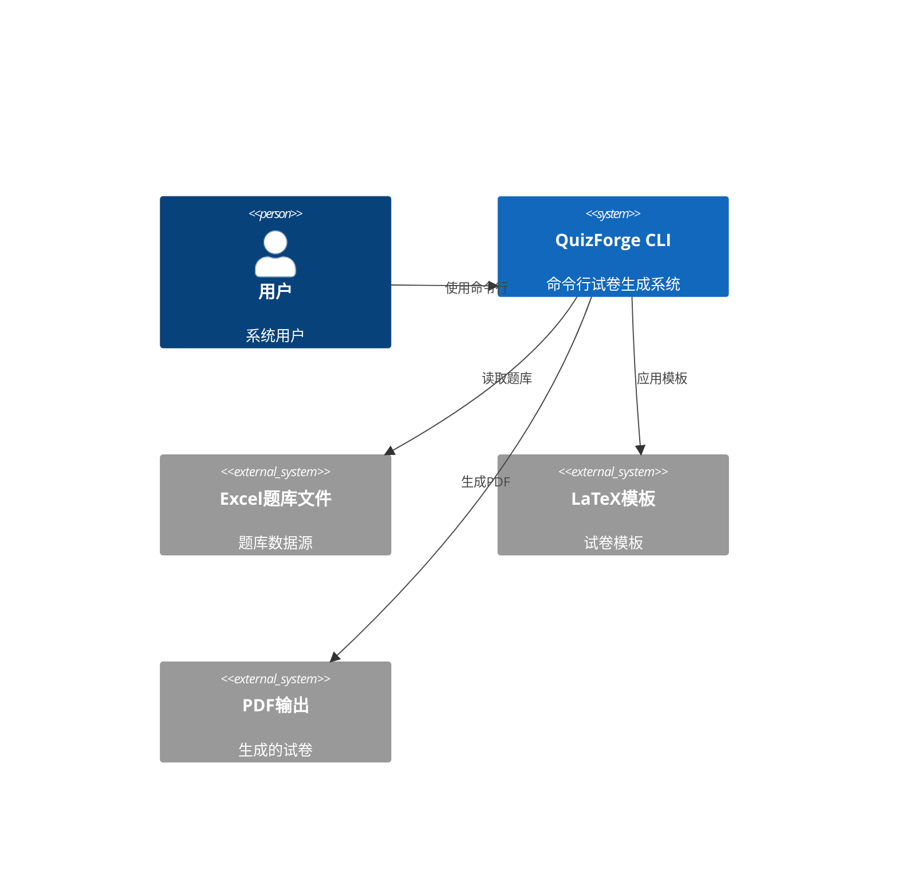
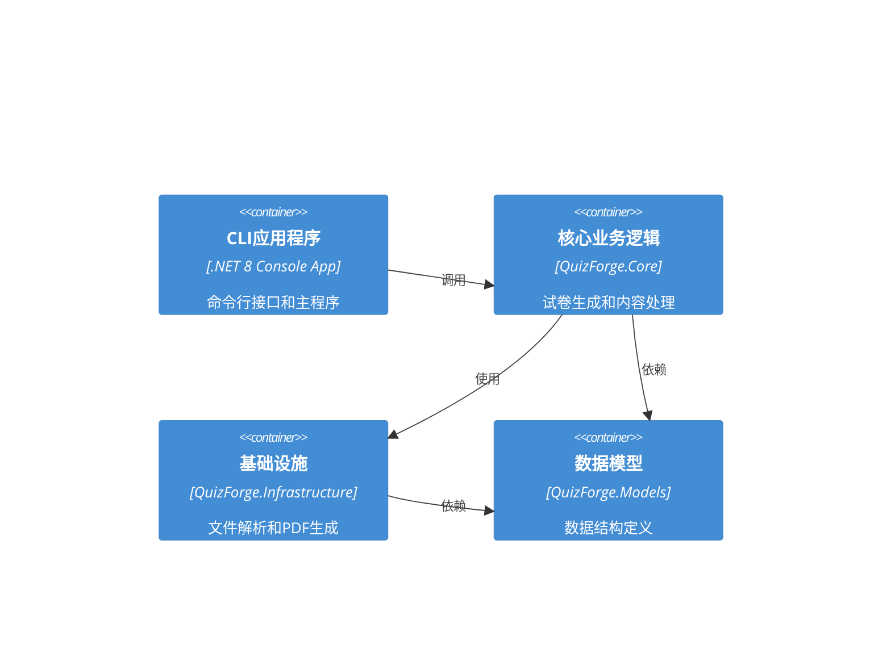
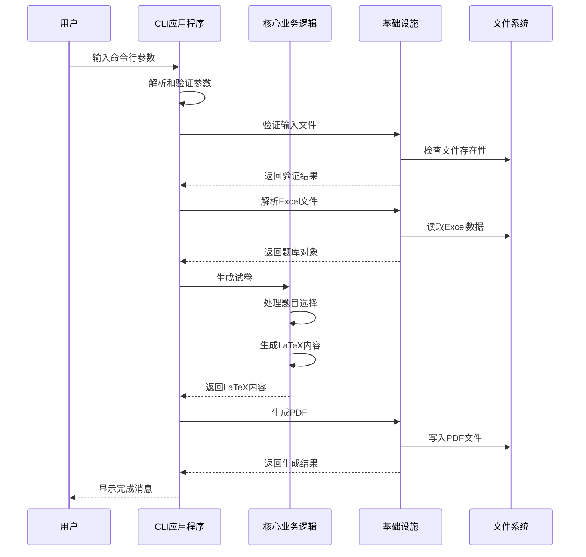
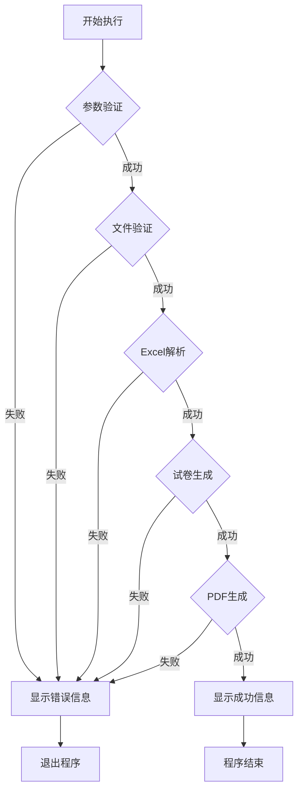
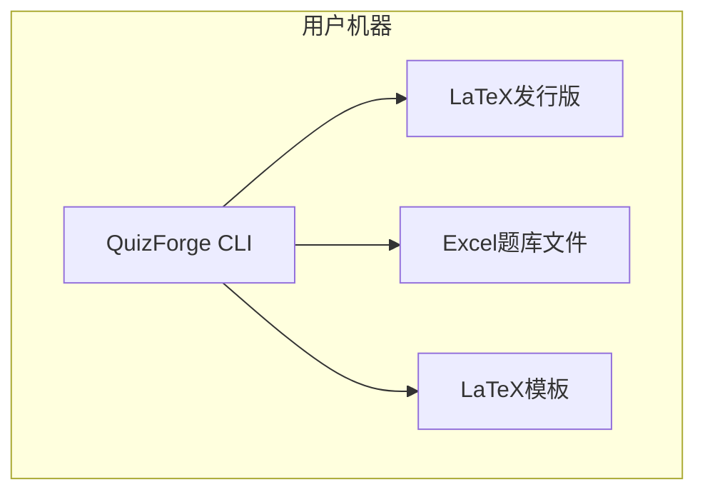
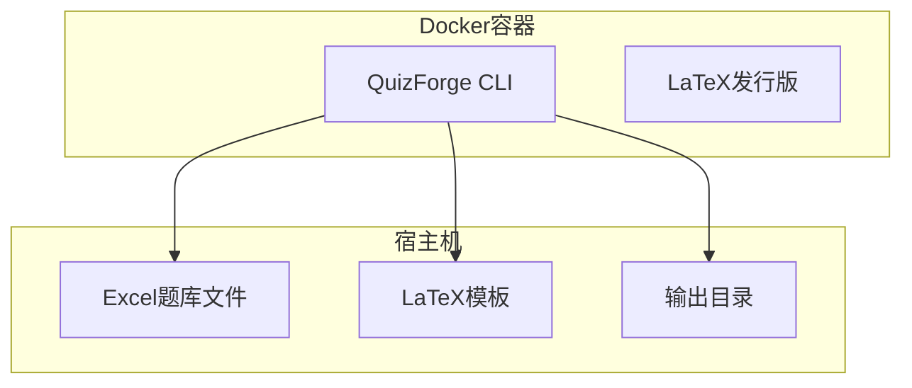

# QuizForge CLI 系统架构设计

## 执行摘要

QuizForge CLI 是基于现有 QuizForge 项目的命令行版本，旨在提供高效的试卷生成工具。该版本复用现有的核心组件，如 ExcelParser、LaTeXDocumentGenerator 和 LatexPdfEngine，通过命令行接口实现自动化试卷生成功能。

## 架构概述

### 系统上下文


### 核心组件架构


## 核心组件设计

### 1. CLI应用程序层 (QuizForge.CLI)

#### Program.cs
- **职责**: 应用程序入口点，命令行参数解析
- **依赖**: Microsoft.Extensions.CommandLineUtils, Microsoft.Extensions.Hosting
- **功能**: 
  - 命令行参数解析和验证
  - 依赖注入容器配置
  - 应用程序生命周期管理
  - 错误处理和日志记录

#### CliOptions.cs
- **职责**: 命令行选项配置模型
- **属性**:
  - `InputFile`: 输入Excel文件路径
  - `OutputFile`: 输出PDF文件路径
  - `Template`: LaTeX模板路径
  - `Title`: 试卷标题
  - `Subject`: 考试科目
  - `QuestionCount`: 题目数量
  - `Difficulty`: 难度级别
  - `Category`: 题目类别
  - `RandomQuestions`: 是否随机选题
  - `IncludeAnswers`: 是否包含答案
  - `Verbose`: 详细输出模式

#### CliCommandHandler.cs
- **职责**: 命令处理和业务逻辑协调
- **方法**:
  - `HandleGenerateCommand()`: 处理生成命令
  - `HandleValidateCommand()`: 处理验证命令
  - `HandleTemplateCommand()`: 处理模板命令
  - `HandleBatchCommand()`: 处理批量生成命令

### 2. 核心业务逻辑层 (QuizForge.Core)

#### ExamPaperGenerator.cs (复用现有组件)
- **职责**: 试卷生成核心逻辑
- **复用方法**:
  - `GenerateExamPaperAsync()`: 生成试卷
  - `GenerateLaTeXContentAsync()`: 生成LaTeX内容
  - `GenerateRandomExamPaperAsync()`: 随机生成试卷

#### ContentGenerator.cs (复用现有组件)
- **职责**: 内容生成器
- **复用方法**:
  - `GenerateQuestionContent()`: 生成题目内容
  - `GenerateAnswerContent()`: 生成答案内容

#### LaTeXDocumentGenerator.cs (复用现有组件)
- **职责**: LaTeX文档生成器
- **复用方法**:
  - `GenerateLaTeXDocument()`: 生成LaTeX文档
  - `GenerateDocumentHeader()`: 生成文档头部
  - `GenerateDocumentContent()`: 生成文档内容

### 3. 基础设施层 (QuizForge.Infrastructure)

#### ExcelParser.cs (复用现有组件)
- **职责**: Excel文件解析器
- **复用方法**:
  - `ParseAsync()`: 解析Excel文件
  - `ValidateFormatAsync()`: 验证Excel格式

#### LatexPdfEngine.cs (复用现有组件)
- **职责**: LaTeX PDF引擎
- **复用方法**:
  - `GenerateFromLatexAsync()`: 从LaTeX生成PDF
  - `GeneratePdfAsync()`: 生成PDF文档

#### CliFileService.cs (新增)
- **职责**: CLI文件服务
- **方法**:
  - `ValidateInputFile()`: 验证输入文件
  - `EnsureOutputDirectory()`: 确保输出目录
  - `FindTemplateFile()`: 查找模板文件

#### CliProgressService.cs (新增)
- **职责**: CLI进度服务
- **方法**:
  - `ShowProgress()`: 显示进度
  - `ShowSuccess()`: 显示成功消息
  - `ShowError()`: 显示错误消息

### 4. 数据模型层 (QuizForge.Models)

#### Question.cs (复用现有模型)
- **职责**: 题目数据模型
- **属性**: Id, Type, Content, Difficulty, Category, Options, CorrectAnswer, Points

#### QuestionBank.cs (复用现有模型)
- **职责**: 题库数据模型
- **属性**: Id, Name, Description, Questions, Format

#### ExamPaper.cs (复用现有模型)
- **职责**: 试卷数据模型
- **属性**: Id, Title, TemplateId, QuestionBankId, Content, TotalPoints, Questions

#### HeaderConfig.cs (复用现有模型)
- **职责**: 页眉配置模型
- **属性**: ExamTitle, Subject, ExamTime, SchoolName, Class, ExamDate

## 数据流设计

### 主要数据流


### 错误处理流


## 部署架构

### 本地部署


### 容器化部署


## 配置管理

### 应用配置 (appsettings.json)
```json
{
  "Logging": {
    "LogLevel": {
      "Default": "Information",
      "Microsoft": "Warning",
      "QuizForge": "Information"
    }
  },
  "LatexSettings": {
    "ExecutablePath": "",
    "TempDirectory": "/tmp/quizforge",
    "TimeoutSeconds": 300
  },
  "FileSettings": {
    "MaxFileSizeMB": 10,
    "SupportedFormats": [".xlsx", ".xls"],
    "OutputDirectory": "./output"
  },
  "TemplateSettings": {
    "DefaultTemplate": "default.tex",
    "TemplateDirectory": "./templates"
  }
}
```

### 命令行配置
```bash
# 基本用法
quizforge generate -i questions.xlsx -o exam.pdf -t "期末考试"

# 完整参数
quizforge generate \
  --input questions.xlsx \
  --output exam.pdf \
  --template custom.tex \
  --title "期末考试" \
  --subject "数学" \
  --question-count 50 \
  --difficulty "中等" \
  --category "代数" \
  --random-questions \
  --include-answers \
  --verbose

# 批量生成
quizforge batch \
  --input questions.xlsx \
  --output-dir ./output \
  --count 5 \
  --template batch.tex
```

## 性能优化策略

### 1. 缓存策略
- **文件缓存**: 缓存已解析的题库文件
- **模板缓存**: 缓存LaTeX模板编译结果
- **PDF缓存**: 缓存生成的PDF文件

### 2. 并发处理
- **批量生成**: 支持多线程批量生成试卷
- **异步处理**: 所有I/O操作使用异步方法
- **资源管理**: 合理管理文件句柄和内存

### 3. 内存优化
- **流式处理**: 大文件使用流式读取
- **对象池**: 重用频繁创建的对象
- **垃圾回收**: 及时释放不再使用的资源

## 安全考虑

### 1. 输入验证
- **文件类型验证**: 只允许支持的文件格式
- **文件大小限制**: 防止过大文件导致内存问题
- **路径安全**: 防止路径遍历攻击

### 2. 权限控制
- **文件权限**: 确保只有授权用户可以访问文件
- **执行权限**: 限制LaTeX执行权限
- **临时文件**: 安全处理临时文件

### 3. 错误处理
- **异常捕获**: 全面的异常处理机制
- **错误日志**: 详细的错误日志记录
- **优雅降级**: 在部分功能失败时提供替代方案

## 监控和日志

### 1. 日志记录
- **结构化日志**: 使用Serilog进行结构化日志记录
- **日志级别**: 支持不同级别的日志输出
- **日志格式**: 统一的日志格式和字段

### 2. 性能监控
- **执行时间**: 记录关键操作的执行时间
- **内存使用**: 监控内存使用情况
- **文件操作**: 监控文件读写操作

### 3. 错误监控
- **错误统计**: 统计错误发生频率
- **错误分类**: 按类型分类错误
- **错误报告**: 生成错误报告

## 扩展性设计

### 1. 插件架构
- **解析器插件**: 支持新的题库格式
- **模板插件**: 支持新的模板类型
- **输出插件**: 支持新的输出格式

### 2. 配置驱动
- **动态配置**: 支持运行时配置更新
- **环境配置**: 支持不同环境的配置
- **用户配置**: 支持用户个性化配置

### 3. API扩展
- **REST API**: 提供HTTP接口
- **GraphQL**: 支持复杂查询
- **WebSocket**: 支持实时通信

## 总结

QuizForge CLI 系统架构设计充分利用了现有项目的基础设施，通过命令行接口提供高效的试卷生成功能。系统采用分层架构，具有良好的可维护性和扩展性。通过合理的错误处理、性能优化和安全考虑，确保系统的稳定性和可靠性。

该架构支持从简单的单个试卷生成到复杂的批量处理，能够满足不同场景的使用需求。同时，通过插件化和配置化的设计，为未来的功能扩展提供了良好的基础。